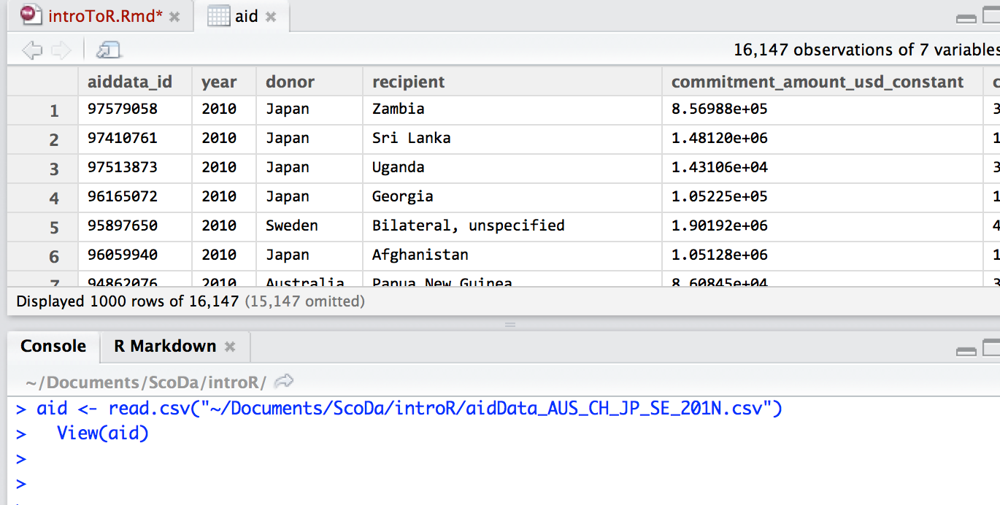
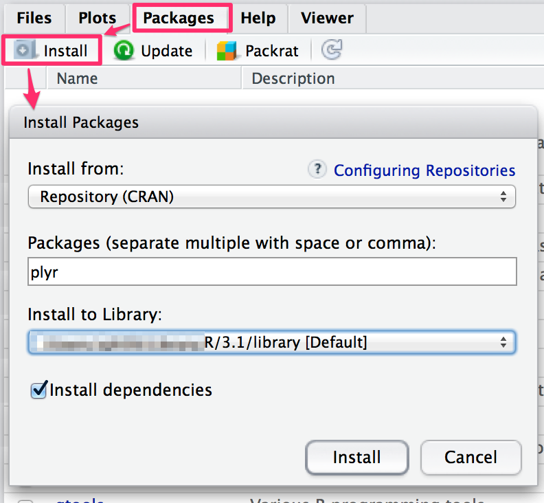
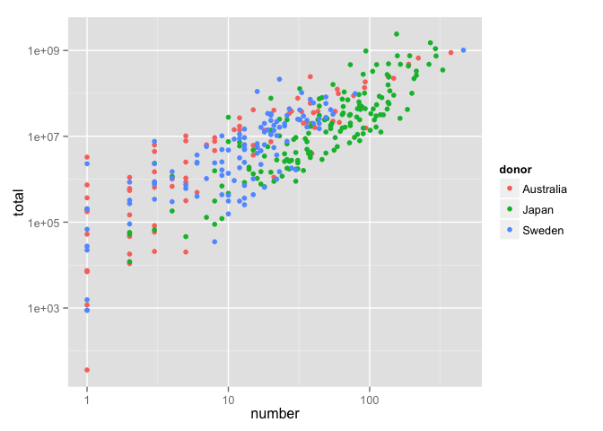
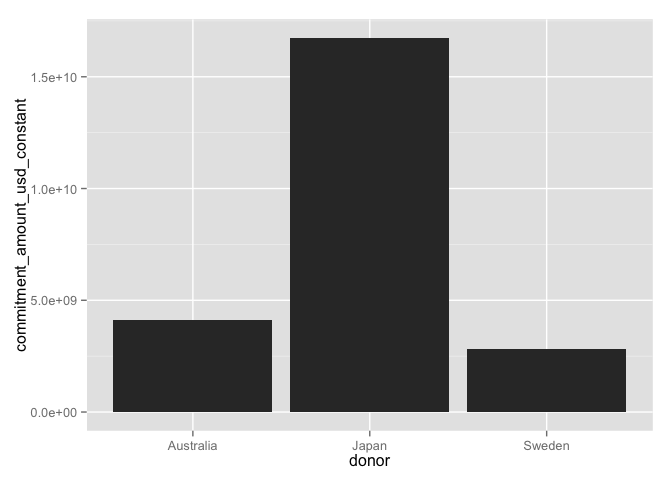
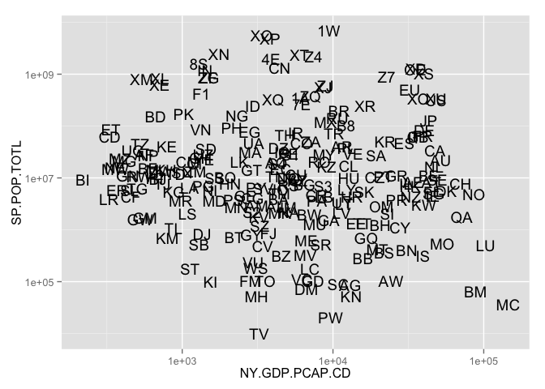
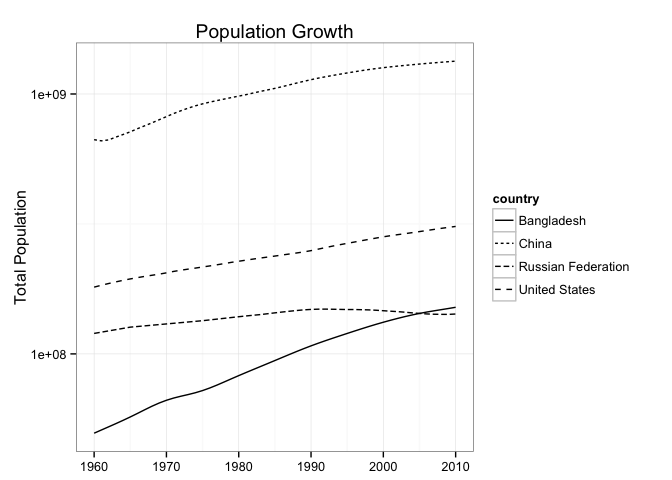

# An Introduction to R and RStudio

For many people working with data on a day to day basis, when it comes to selecting a tool to actually work with the data, a spreadsheet is often the first application they think of. Spreadsheets are undoubtedly powerful tools, but sometimes it can be hard to keep track of what's going on in them. At other times, you perhaps need more control over the data you want to work with, or the things you want to do with it.

R is a programming language originally developed as a *statistical programming language* - it's very good at running statistical calcualations and there is a huge collection of statistical tests that you can apply using it. More recently, however, people have started to see it as an environment for *wrangling* data, particularly summarising it, getting it into the right shape, and visualising it.

In this course, you'll learn how to get started using R for some simple exploaratory data analysis, in particular filtering, sorting, summarising, shaping and visualising data within the RStudio environment. There's a lot to cover, so let's get started...

## Objectives

- learn how to use RStudio to import from files and online services and export data in a variety of file formats
- learn how to use dataframes to sort and filter datasets
- learn how to summarise tabular datasets and run simple statistics over them
- learn how to transform the shape of a dataset
- learn how to plot a variety of charts using ggplot2

## Getting Started

To work through this course, you will need to install a recent version of R. R is available for Windows, Mac and Linux computers and can be downloaded from here: [download and install R for your platform](http://cran.rstudio.com/).

The easiest is way of using R is to run it from within the RStudio application. RStudio is available for Windows, Mac and Linux computers and can be downloaded from here: [download and install RStudio Desktop for your platform](http://www.rstudio.com/products/rstudio/download/).

The RStudio application can be accessed via a browser. This means that R and RStudio can be hosted on a remote virtual server and accessed via a web browser over an internet connection. If you would prefer to run a remote version of R/RStudio rather than installing it on you own computer, you can find an example here: [Louis Aslett: *RStudio Server Amazon Machine Image (AMI)*](http://www.louisaslett.com/RStudio_AMI/).

R and RStudio can also be run in a virtual machine on your own computer. For an example, see [Dieter Menne: *Running R Shiny and RStudio Server in a Virtual Box*](https://bitbucket.org/dmenne/rstudio-shiny-server-on-ubuntu).

## The RStudio Environment

When you launch RStudio, you will be presented with an application that looks something like the following:


If you aren't familiar with programming IDEs - *integerated development environments* - it can be quite overwhelming at first, but you'll soon learn to find your way around it.

Different people tend to have different workflows or preferred ways of working in RStudio. For example, you can load data in via the *Import Dataset* menu, or by a typed command that loads a data in from a file on your computer, on the web, or from a database or online API. You can work with data loaded into RStudio by executing commands directly on the command line, or you can write reports in an R Markdown/Rmd file that blends text and R commands to generate reports containing your text, the R commands, *and the outputs from those commands*.

We'll touch on each of those as we work through the course.

## Loading in a Dataset

The first thing we are going to do is createa new project to keep our programme files together. From the menu in the top right hand corner, create a new project in a new working directory - and keep track of where that directory is!

Now we need to load in a dataset. We can load in data from a text file such as a CSV file on our own computer or download one directly from the web using the *Import Dataset* menu.

*Note, on some platforms RStudio appears to have difficulty downloading files from URLs starting* https *without some additional work. In such cases, download the file to your computer and load it in as a text file.*

*R can also load data in from Excel spreadsheet files but that requires a little bit more work too.*

I have created a test data file using a sample of data from [aidData.org](http://aiddata.org/aiddata-research-releases) (*Tierney, Michael J., Daniel L. Nielson, Darren G. Hawkins, J. Timmons Roberts, Michael G. Findley, Ryan M. Powers, Bradley Parks, Sven E. Wilson, and Robert L. Hicks. 2011. More Dollars than Sense: Refining Our Knowledge of Development Finance Using AidData. World Development 39 (11): 1891-1906*) containing data for just over 15,000 aid payments from Australia, Japan, and Sweden from 2010. You can download the data from here: [aidData_AUS_CH_JP_SE_201N.csv](https://raw.githubusercontent.com/psychemedia/schoolofdatarelated/gh-pages/data/aidData_AUS_JP_SE_201N.csv). Save the file as *aidData_AUS_CH_JP_SE_201N.csv* into your R project directory.

*If you would rather work with the complete dataset of over a million rows, R will handle it quite happily; you can find the full dataset on the AidData website.*

Now import the dataset from the file using the *Import Dataset* menu option in the RStudio Environment panel.


When you load the data in, you should see a view of it appear, along with some generated code in the Console - the code that actually ran when you clicked on `Import`.



You might also notice the `View(aid)` command. This is the command that loaded the data - data I named as `aid` and that we can refer to as such - into the view window.

If I now type `head(aid)` into the console and hit return, I can preview the first 10 lines of the data file in the console. An additional parameter (`n`) lets me specify how many lines to preview (the default is 10). The `tail()` command can be similarly used to inspect the *last* few rows of the dataset.


```r
head(aid,n=5)
```

```
##   aiddata_id year  donor              recipient
## 1   97579058 2010  Japan                 Zambia
## 2   97410761 2010  Japan              Sri Lanka
## 3   97513873 2010  Japan                 Uganda
## 4   96165072 2010  Japan                Georgia
## 5   95897650 2010 Sweden Bilateral, unspecified
##   commitment_amount_usd_constant coalesced_purpose_code
## 1                       856988.0                  31140
## 2                      1481200.0                  15110
## 3                        14310.6                  31110
## 4                       105225.0                  12230
## 5                      1901920.0                  43030
##                     coalesced_purpose_name
## 1             Agricultural water resources
## 2 Public sector policy and adm. management
## 3        Agricultural policy & admin. mgmt
## 4              Basic health infrastructure
## 5         Urban development and management
```

*When you see commands in the format show above, treat that as a prompt to try out the commands for yourself in the RStudio console.*

If you want to see documentation for a function, such as documentation for the `head()`, type `?head` (without the brackets) into the console.

## Working With the Data

The R language was originally developed to support statistics calculations. As you might therefore expect, it can easily do simple statistics on our data.

The first thing we need to do is just check to see what sort of thing R thinks each data column refers to. The `str()` command asks what R knows about the ***str**ucture* of a dataset.


```r
str(aid)
```

```
## 'data.frame':	16147 obs. of  7 variables:
##  $ aiddata_id                    : int  97579058 97410761 97513873 96165072 95897650 96059940 94862076 97403919 96171632 97352341 ...
##  $ year                          : int  2010 2010 2010 2010 2010 2010 2010 2010 2010 2010 ...
##  $ donor                         : Factor w/ 3 levels "Australia","Japan",..: 2 2 2 2 3 2 1 2 2 2 ...
##  $ recipient                     : Factor w/ 163 levels "Afghanistan",..: 162 133 153 56 18 1 115 126 60 95 ...
##  $ commitment_amount_usd_constant: num  856988 1481200 14311 105225 1901920 ...
##  $ coalesced_purpose_code        : int  31140 15110 31110 12230 43030 15250 31192 74010 72040 32110 ...
##  $ coalesced_purpose_name        : Factor w/ 182 levels "Administrative costs",..: 14 133 11 21 173 100 122 39 50 96 ...
```

Here, we see that the the *aiddata_id*, *year* and *coalesced_purpose_code* are identifed as type `int` (that is, *int*eger, or whole number), the *commitment_amount_usd_constant* is a *num*eric type (that is, a number) and the other columns of *factors*. The factors are 'sorts of thing' - the factor levels show the different unique type or sort of column thing they are.

This different column types are important becuase they limit the sorts of operation we can apply to a column.

We can change the type of a column by setting it to a particular type. For example, the *coalesced_purpose_code* may not really be a number, the codes could perhaps equally have been random jumbles of letters, so perhaps we want that column to be a *factor* type.


```r
aid$coalesced_purpose_code =  as.factor(aid$coalesced_purpose_code)
```

Note how we refer to the column as `DATASET_NAME$COLUMN_NAME`. We can set other columns to different types using constructions such as `as.integer()`, or `as.numeric()`. If you have something identified as a *factor* that you want to be an integer, you first need to make it a string of characters before setting it as an integer, for example using the construction: `as.integer(as.character())`.

We can find out what the unique levels of a factor column are by using the `levels()` function:


```r
levels(aid$donor)
```

```
## [1] "Australia" "Japan"     "Sweden"
```

**Exercise**: *What different `recipient` countries are there?*

When it comes to the numerical payment column, we can get some summary statistics using the `summary()` function:


```r
summary(aid$commitment_amount_usd_constant)
```

```
##      Min.   1st Qu.    Median      Mean   3rd Qu.      Max. 
##         0     16830     71210   1467000    288800 957600000
```

We could separately identify the mean payment using `mean(aid$commitment_amount_usd_constant)`, the *median* amount using the `median()` function, and so on.

### Sorting

One of the quickest ways of getting to grips with a dataset is to sort it. We can sort the data by one or more columns using the `arrange()` function. This function is actually part of an additional R package called `plyr` which we need to install from the CRAN package archive. 



Once installed (and we should only need to install it once), we can then load it in to RStudio using the command `library()`.


```r
library(plyr)
```

We can now use the `arrange()` function: pass in the dataframe name, and the column you want to sort on; the default sort order is in ascending order, but we can specify we want a *descending* order by using `desc()` applied to the column name.

To limit the data columns shown using the `head()` command, I can specify a subset of selected columns I want to be displayed. The column names are listed in quotes in a list specified using the convention `c("FIRST COLUMN", "SECOND COLUMN", ... , "LAST COLUMN")`:


```r
# Setting x=someFunction(x) updates x to be x after someFunction() is applied to it.
aid=arrange( aid, desc(commitment_amount_usd_constant) )
head( subset( aid, select=c("donor","recipient","commitment_amount_usd_constant") ), n=5 )
```

```
##   donor              recipient commitment_amount_usd_constant
## 1 Japan                  India                      957624000
## 2 Japan Bilateral, unspecified                      700674000
## 3 Japan                  India                      607007000
## 4 Japan                 Turkey                      459002000
## 5 Japan                  Egypt                      417714000
```

If you now click on the *aid* data item in the RStudio Environment tab, you should see that the previewed rows are suited in descending order by commitment amount.

### Filtering

As well as using the `subset()` command to select different columns, we can select different subsets of rows. For example, I could create a new dataframe that contains only payments made to Indonesia previewing the resulting dataframe using either the `View()` command myself or by clicking on the new dataframe in the Environment tab.


```r
to_indonesia = subset( aid,
                       subset = (recipient=="Indonesia"),
                       select=c("donor","recipient","commitment_amount_usd_constant") )
View(to_indonesia)
```

We could further filter the new *to_indonesia* dataframe to only show payments made from Japan, or we could do both steps in a single command by using a logical AND (the &) to show the two conditions must both be met at the same time. (A logical OR operator, |, is also available.)


```r
japan_to_indonesia = subset( aid,
                       subset = (recipient=="Indonesia" & donor=="Japan"),
                       select=c("donor","recipient","commitment_amount_usd_constant") )
View(japan_to_indonesia)
```

We could then save this dataframe as a new CSV data file so that if we wanted to work with this subset of the data, we wouldn't have to do the filtering operation a second time:


```r
write.csv(japan_to_indonesia, file = "aidData_japan_to_indonesia.csv",
          row.names=FALSE, na="")
```

The file will be saved in the current working directory.

As well as filtering on equivalent values using the == operator, we can also look for things that are not equal to a particlar value (!=), or for numerical quantities use greater than or less than comparisons.

For example, we could find payments of at least five hundred million dollars in the following way:


```r
subset( aid,
        subset = (commitment_amount_usd_constant >= 500000000),
        select=c("donor","recipient","commitment_amount_usd_constant") )
```

```
##   donor              recipient commitment_amount_usd_constant
## 1 Japan                  India                      957624000
## 2 Japan Bilateral, unspecified                      700674000
## 3 Japan                  India                      607007000
```

**Exercise**: *How would you find payments over 50 million dollars made by Sweden?*

**Exercise**: *How would you display the ten largest payments made by Australia?*

### Summarising

In many situations where we have a large number of data items, we may want to summarise them, for example by finding mean or median values of particular groupings of data, or finding the top and bottom ranked items in sorted groups of the data. For example, we might wonder what the total commitment from each donor country was in the data we have.

The *plyr* library contains several very powerful tools for generating summaries over a data set. In particular, the `ddply()` function provides what is sometimes referred to as a *split-apply-combine* pattern in which a dataset is *split* into separate groups, a function is *applied* to each group, and then the results are *combined* back together. For example, let's see what the summed commitment from each donor is in the data we have:


```r
#Assign the results of the split-apply-combine to a variable
commitments=ddply( aid, .(donor), summarise, total=sum(commitment_amount_usd_constant) )
#Display the value of the variable
commitments
```

```
##       donor       total
## 1 Australia  4135503893
## 2     Japan 16738907161
## 3    Sweden  2820420464
```

That `ddply()` statement may appear quite scary at first, but we can pick it apart. It reads as follows: *split the aid dataframe ("ddply(aid,") by the unique donors (".(donor)"), then produce a summary table ("summarise,") with a 'total' column containing the summed commitments from each donor ("total=sum(commitment_amount_usd_constant)")*.

Note that you can't ask for help (using the `?` prefix in the console) on a function that appears in a particular library until you load in that library.

**Exercise**: *How would you find the total amount committed to each recipient?*

**Exercise**: *Whereas the `sum()` function summed the separate commitment values to give a summed group total, the `length()` function can be used to count the number of items in a group. How would you produce a summary table that counts the commitments made to each recipient? How would you then go on to display a table showing the top 10 recipients by number of commitments?*

Part of the power of the split-apply-combine approach is that we can start to extend the summary based on finer grained groupings, or the addition of extra results columns. For example, if we want to group on (donor,recipient) pairs, we can do so. We can also generate more than one results column; for example, we might add in a count of the number of commitments made from each donor to each recipient. We can then sort on both these columns and display a league table of the top five (donor, recipient) pairings, for example, sorted on commitment count and total value:


```r
finercommitments=ddply( aid, .(donor, recipient), summarise,
                        total=sum(commitment_amount_usd_constant),
                        number=length(commitment_amount_usd_constant))

head( arrange(finercommitments, desc(number), desc(total)), n=5)
```

```
##       donor              recipient      total number
## 1    Sweden Bilateral, unspecified 1019246015    461
## 2 Australia Bilateral, unspecified  890848255    376
## 3     Japan                  China  350491736    329
## 4     Japan               Viet Nam  744085213    295
## 5     Japan              Indonesia 1101028943    292
```

Even with large datasets, such as the complete Aid Data dataset, R can generate this sort of summary report in a very efficient way.

### Shaping

The *shape* of a dataset is one way of talking about the organisation of its rows and columns. For example, the summary reports that show the number of, and summed total commitments to, each recipient country are represented in what is often referred to as a *long* table format. Each recipient may appear on multiple rows, with the donor column identifying which donor a particular report applies to.


```r
example.df=subset(finercommitments,
       subset=(recipient=='Yemen' | recipient=='Zambia' ) )
example.df
```

```
##         donor recipient       total number
## 77  Australia     Yemen  1490313.60      3
## 78  Australia    Zambia    20141.38      5
## 236     Japan     Yemen 42329211.28     86
## 237     Japan    Zambia 24168140.06    108
## 353    Sweden     Yemen  6745142.28     16
## 354    Sweden    Zambia  5473503.34     21
```

We can rearrange this data into a *wide* format in which each recipient has a single row but the different *donors* are represented using columns.

The `reshape2` library contains several useful routines that help us shape and reshape a dataset. Let's load it in.


```r
library(reshape2)
```

The `dcast()` function allows us to go from a long format to a wide format. We need to pass in several things to the function:

* the dataframe,
* which column or columns we want to use to identify the "key" columns that identify each row, along with the original column whose values we want to use as the wide format column headings
* the original column whose *value* we want to use in each cell in the newly created columns.


```r
dcast(example.df,
     recipient~donor,
     value.var='total')
```

```
##   recipient  Australia    Japan  Sweden
## 1     Yemen 1490313.60 42329211 6745142
## 2    Zambia   20141.38 24168140 5473503
```

Note that we need to use quotation marks when setting the *value* parameter.

The `cast()` function can also do aggregation calculations on long datasets, which can save us the effort of having to create appopriate summary datsets ourself using the `ddply()` function. 


```r
#When using a logical OR to filter data on multiple items,
#we can list those items and test against them using the %in% operator
example.df.raw = subset(aid,subset=recipient %in% c('Yemen','Zambia','Zimbabwe') )
                    
example.wide = dcast(example.df.raw,
                   recipient~donor,
                   fun.aggregate=sum,
                   value.var='commitment_amount_usd_constant')
example.wide
```

```
##   recipient   Australia    Japan   Sweden
## 1     Yemen  1490313.60 42329211  6745142
## 2    Zambia    20141.38 24168140  5473503
## 3  Zimbabwe 38337913.21 18130937 25769797
```

As well as going from long to wide format, we can go the other way - from wide to long - using the `melt()` function. The *measure.vars* specifiy which wide columns we want to melt into a new long column. (If no *measure.vars* columns are explicilty set, all non-id columns are melted). The selected wide columns are melted into two new long columns. A *variable* column that contains the original wide column name, and a *value* column that contains the original wide column cell value. The two *.name* parameters can be used to set the new variable and value column names explicitly.


```r
melt(example.wide,
     id.vars=c("recipient"),
     measure.vars=c("Australia","Sweden"),
     variable.name = "Donor Country",
     value.name="Total Commitment" )
```

```
##   recipient Donor Country Total Commitment
## 1     Yemen     Australia       1490313.60
## 2    Zambia     Australia         20141.38
## 3  Zimbabwe     Australia      38337913.21
## 4     Yemen        Sweden       6745142.28
## 5    Zambia        Sweden       5473503.34
## 6  Zimbabwe        Sweden      25769797.38
```

### Merging Data

In many situations, we may want to combine data from different data tables into a single dataset. The data may even come from different sources, as you will see in this section.

As well as being able to load data into R from a file on your computer or a remote location on the web, several R packages have been created that provide straightforward access to remote data sources. For example, the `WDI` package provides an interface to the [World Bank Development Indicators](http://data.worldbank.org/indicator/) database.

From the RStudio *Packages* panel, install the `WDI` package and then load it in to RStudio.


```r
#install.packages("WDI")
library(WDI)
```

As well as calling the World Bank API, the package contains some data locally. For example, we can get a list of country names and their international codes using the following construction (don't worry about how it's put together!).


```r
countryCodes= subset( WDI_data[2]$country, select=c("iso3c","iso2c","country"))
head(countryCodes)
```

```
##      iso3c iso2c country      
## [1,] "ABW" "AW"  "Aruba"      
## [2,] "AFG" "AF"  "Afghanistan"
## [3,] "AGO" "AO"  "Angola"     
## [4,] "ALB" "AL"  "Albania"    
## [5,] "AND" "AD"  "Andorra"    
## [6,] "ARB" "1A"  "Arab World"
```

We can use the `merge()` function to merge the country codes data with the aid data by matching columns sharing the same country name. We pass in the two dataframes we want to merge and then specify which columns from each to merge on; *by.x* identifies the merge column or columns in the first dataset, *by.y* those in the second. If the merge column name(s) are the same in both dataframes, we can set a single *by* parameter instead.


```r
merge(example.wide, countryCodes, by.x='recipient', by.y='country')
```

```
##   recipient   Australia    Japan   Sweden iso3c iso2c
## 1    Zambia    20141.38 24168140  5473503   ZMB    ZM
## 2  Zimbabwe 38337913.21 18130937 25769797   ZWE    ZW
```

Let's see how we can now pull some more data in from the World Bank and add it to the mix. We can pull down data for one or more particular indicators and one or more countries (or all countries) using the `WDI` package. For example, we can pull in the [GDP per capita (US$) - NY.GDP.PCAP.CD](http://data.worldbank.org/indicator/NY.GDP.PCAP.CD) and the [Total population - SP.POP.TOTL](http://data.worldbank.org/indicator/SP.POP.TOTL) for some specified countries:


```r
wbdata=WDI(country=c("ZM","ZW"), indicator=c("NY.GDP.PCAP.CD","SP.POP.TOTL"),start=2010, end=2010)
wbdata
```

```
##   iso2c  country year NY.GDP.PCAP.CD SP.POP.TOTL
## 1    ZM   Zambia 2010      1224.9539    13216985
## 2    ZW Zimbabwe 2010       723.1646    13076978
```

We can then merge this with the aid data:


```r
example.wide.cc=merge(example.wide, subset(countryCodes,select=c("country","iso2c")),
                       by.x='recipient', by.y='country')

example.df.2 = merge(example.wide.cc, subset(wbdata,select=c('iso2c',"NY.GDP.PCAP.CD","SP.POP.TOTL")),
      by='iso2c')
```

We could now work out the commitment made to each recipient in terms of the commitment made per capita in the recipient country, and compare this to the GDP per capita in the recipient country.


```r
example.df.2$Australia.rpc = example.df.2$Australia / example.df.2$SP.POP.TOTL
example.df.2$Japan.rpc = example.df.2$Japan / example.df.2$SP.POP.TOTL
example.df.2$Sweden.rpc = example.df.2$Sweden / example.df.2$SP.POP.TOTL

example.df.2
```

```
##   iso2c recipient   Australia    Japan   Sweden NY.GDP.PCAP.CD SP.POP.TOTL
## 1    ZM    Zambia    20141.38 24168140  5473503      1224.9539    13216985
## 2    ZW  Zimbabwe 38337913.21 18130937 25769797       723.1646    13076978
##   Australia.rpc Japan.rpc Sweden.rpc
## 1   0.001523901  1.828567  0.4141265
## 2   2.931710461  1.386478  1.9706233
```

**Exercise**: *Look up the population for each donor country and then find out how much commitment per capita in the donor country is being made to each recipient.*

## Looking at the Data

Sometimes it can be really useful to look at a data set in a more visual way than as just a tabular dataset. R includes support for producing a wide range of statistical charts, but several other libraries offer even more powerful charting facilities.

From the RStudio *Packages* panel, install the `ggplot2` package and then load it in.


```r
#install.packages("ggplot2")
library(ggplot2)
```

`ggplot2` is based on a way of thinking about graphical charts known as *The Grammar of Graphics*. Chart objects are constructed as a set of separate graphical layers that are projected onto a scaled canvas. To create a chart, we pass in a dataset and then describe how we want to map elements of the dataset onto the chart.

The `ggplot()` function creates the base chart for the dataset we are interested in, and the `geom_` statements identify what sort of graphical representation we would like to use. The `aes()` function defines the chart *aesthetics* that map different data columns onto different visual variables: the *x* location, or *y* location, or *colour* of each point for example.


```r
g = ggplot(finercommitments)+geom_point(aes(x=number,y=total,colour=donor))
g
```

 

We can manipulate various elements of the chart by adding further operations to it. For example, we might want to scale both the x and y axes according to a logarithmic function so we can more easily see how the *total* and *number* quantities compare.


```r
g +scale_y_log10()+scale_x_log10()
```

 

As well as plotting points, `ggplot` supports a wide range of chart types, many of which can perform calculations themselves from the base data. For example, in a bar chart, the chart can sum up separate individual values down a column to give summed totals using the *stat="identity"* setting.


```r
ggplot(aid) + geom_bar(aes(x=donor,y=commitment_amount_usd_constant),
                                  stat='identity')
```

 

A text plot provides a handy way of identifying points on a scatter plot.


```r
wbdata.all=WDI(country='all', indicator=c("NY.GDP.PCAP.CD","SP.POP.TOTL"),start=2010, end=2010)

g=ggplot(wbdata.all)
g=g+geom_text(aes(x=NY.GDP.PCAP.CD, y=SP.POP.TOTL, label=iso2c))
g+scale_x_log10()+scale_y_log10()
```

 

To plot time series, we often make use of a line plot. For example, if we pull down population data from the World bank Indicator API for a series of years, we can plot that data. We can also start to style the chart a little more by cutomising the labels and applying a different theme to the chart.


```r
popdata=WDI(country=c('US','RU','CN','BD'), indicator=c("SP.POP.TOTL"),start=1900, end=2010)

g=ggplot(popdata)
g=g+geom_line(aes(x=year,y=SP.POP.TOTL,linetype=country))+scale_y_log10()
g=g+ggtitle("Population Growth")+xlab(NULL)+ylab('Total Population')
g+theme_bw()
```

 

The `ggplot` library is a very powerful and flexible one that repays experimentation. Comprehensive documentation is available: [`ggplot2` documentation](http://docs.ggplot2.org/current/). It is particularly suited to generating statis charts appropriate for print. However, a range of libraries are also becoming available that support the creation of interative web charts, using similar chart construction ideas. For example, see [rCharts](http://rcharts.io/), [googleVis](http://cran.r-project.org/web/packages/googleVis/vignettes/googleVis_examples.html) or [ggvis](http://ggvis.rstudio.com/).


## Summary
This course has provided an introduction to R and the RStudio environment, with a focus on how R and some of its associated extension libraries can be used to support a wide range of data wrangling and exploratory data analysis activities.

In particular, we have introduced the RStudio development environment and shown how to load simple data files into in a structured way from text based CSV files and from online data APIs such as the World Bank Indicators API.

To support data wrangling activities, we briefly reviewed several R libraries and the features they support:

* `plyr`, for sorting datasets using the `arrange()` function and summarising datasets using the *split-apply-combine* pattern using the `ddply()` function;
* `reshape2` for reshaping tabular datasets, for example using `dcast()` to cast a long dataframe to a wide format table, and `melt()` to convert a wide format data table to a long one;
* `ggplot2` for plotting a range of statistical charts.

Exploring the potential of each of these libraries and the sorts of data handling operations they support could each take a course in its own right. However, we hope you have at glimpsed how they can be used together as part of a rich data processing pipeline.

## Taking R Further

Given the short nature of this course, we have only had time to provide a brief overview of what the `plyr`, `reshape2` and `ggplot2` libraries are capable of. There is a wealth of documentation and tutorials how to use them onine, especially on sites such as RBloggers and StackOverflow.

As befits its origins as a statistical programming language, R also provides extensive support for confirmatory statistical analysis.

In addition, RStudio has been developed with workflow integration in mind. Projects can be associated with version controlled project directories (including integration with git and Github), and the `knitr` package is deeply integrated into RStudio. `knitr` supports the creation of RMarkdown documents that can blend text and R code in the same document, executing the R code and then including the results in the output document itself. A variety of output document types are supported, including HTML, PDF and HTML5 slides (a browser based presentation/slideshow format). In fact, this course was authored using RMarkdown. You can see the original "source code" for this course here: [introToR.Rmd](https://raw.githubusercontent.com/psychemedia/schoolofdatarelated/master/introR/introToR.Rmd).

Finally, the RStudio team have also been instrumental in developing the R `shiny` package, which supports the creation and publishing of interactive data driven applications. For more infromation, see [RStudio: *Shiny* web application framework](http://shiny.rstudio.com/). 
